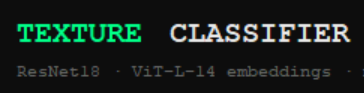
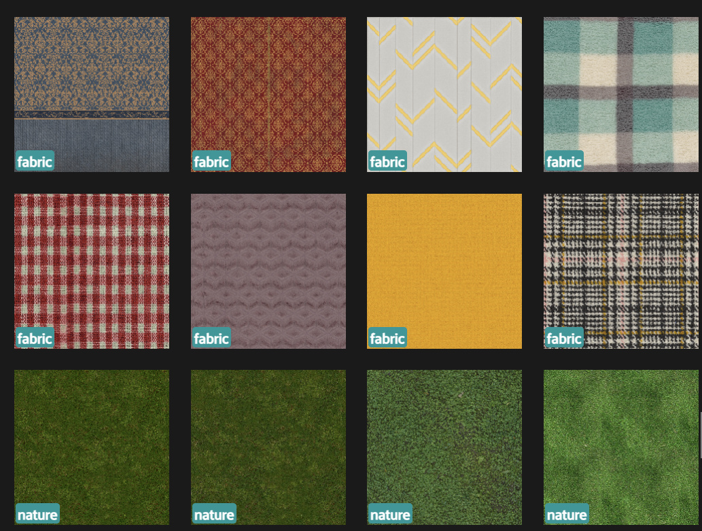
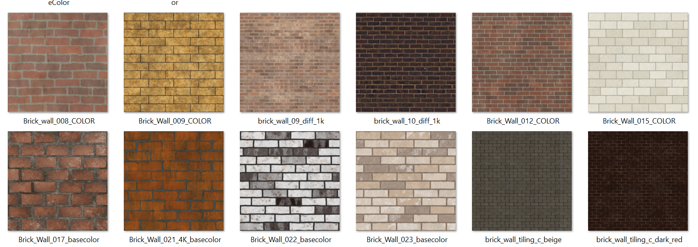
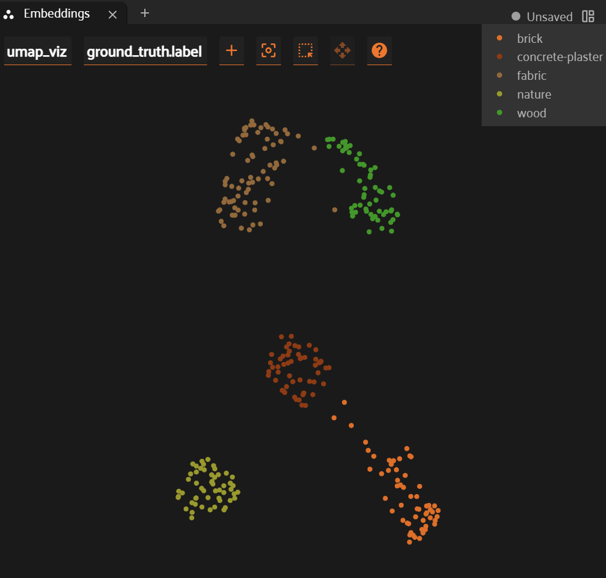
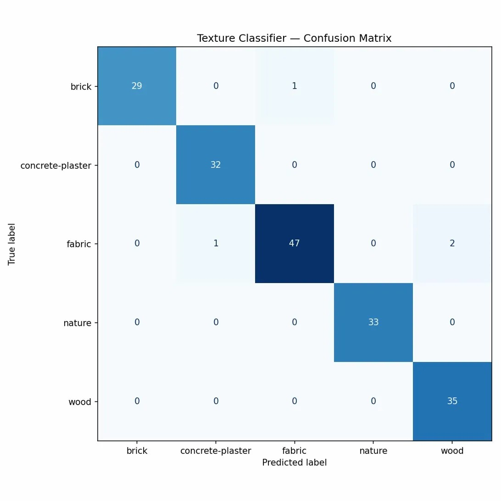
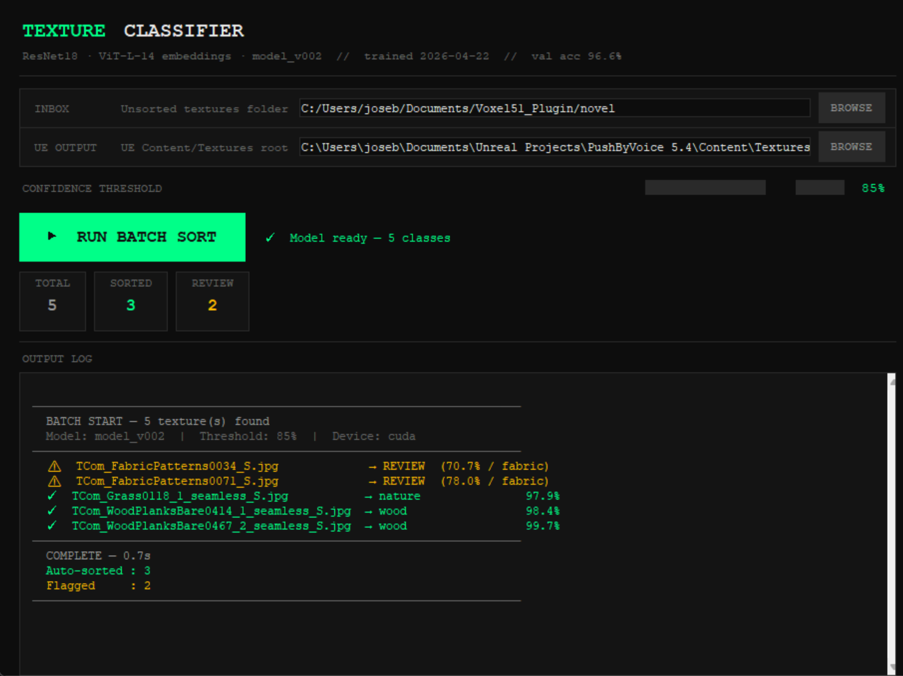

# TextureClassifier


A vision-based tool for classifying texture maps and routing them into structured folders. Built on a ResNet18 fine-tuned against a CLIP-curated dataset of five material categories: **brick**, **concrete-plaster**, **fabric**, **nature**, and **wood**.

The tool is designed for the moment manual sorting actually breaks down: bulk ingestion. Whether you're absorbing a vendor's library, reorganizing scan output, or onboarding freelance deliverables, it reads the visual content of each texture and sorts it into your project's taxonomy. Sorting goes from a per-file decision to a one-click batch operation — the artist's attention is reclaimed; the model handles the routing.

Predictions above a configurable confidence threshold auto-sort; anything ambiguous is routed to a Review folder for human evaluation. Training, evaluation, and inference are versioned end-to-end, so model changes are traceable and rollback is one config line.

Two natural extensions sit on the roadmap. *Audit mode* reads an existing folder structure and flags miscategorized assets without moving them — a continuous QA layer for libraries that drift over time. *Content-aware renaming* standardizes file names based on predicted class and visual features. Neither is built yet; both are small additions on top of the same model.

**Validated**: ~300 textures, 5 classes, 96.6% held-out validation accuracy.
**Not yet validated**: larger datasets, taxonomies with 10+ classes, visually overlapping categories (e.g. "polished concrete" vs "matte concrete").



---

## Pipeline overview

The project decomposes into five stages, each a standalone script:

| Stage | Script | Purpose |
|-------|--------|---------|
| 1. Normalize | `image_normalization.py` | Square-crop and 8-bit RGB conversion of raw textures |
| 2. Embed | `compute_embeddings.py` | Cache CLIP (ViT-L/14) embeddings for dataset analysis |
| 3. Visualize | `launch_visualizer.py` | UMAP plot in FiftyOne for cluster inspection |
| 4. Train | `model_training.py` | Fine-tune ResNet18 with versioned model registry output |
| 5. Use | `TextureClassifier_v001.py` | Tkinter UI for batch sorting into UE project folders |

Two diagnostic scripts sit alongside the pipeline:

- `model_inference.py` — CLI sanity check, classifies a single image
- `visualizer_DataBleeding.py` — confusion matrix + per-class accuracy on the held-out val set

---

## Setup

```bash
# Clone the repo
git clone https://github.com/<your-username>/texture-classifier.git
cd texture-classifier

# Create a virtual environment (recommended)
python -m venv .venv
source .venv/bin/activate          # Linux/macOS
.venv\Scripts\activate              # Windows

# Install dependencies
pip install -r requirements.txt
```

If you're on Linux and `tkinter` is missing, install it via your package manager (see `requirements.txt` for distro-specific commands).

---

## Quick start

### 1. Add textures to the dataset

Drop your training images into `textures/<class>/` — the folder names become the class labels. The repo ships with five empty class folders matching the validated taxonomy; replace or rename them as needed. See `textures/README.md` for image requirements.



### 2. Normalize the dataset

```bash
python image_normalization.py
```

Center-crops non-square images, converts everything to 8-bit RGB, and converts TIFFs to PNG.

### 3. Compute CLIP embeddings (optional but recommended)

```bash
python compute_embeddings.py
```

Caches a ViT-L/14 embedding for each image in `embeddings_cache.npz`. Incremental — only processes images that aren't already cached.

### 4. Inspect the dataset visually

```bash
python launch_visualizer.py
```

Opens FiftyOne with a UMAP plot of the embeddings. Use this to spot mislabeled samples, ambiguous edge cases, and class imbalance before training. Read more in [docs/dataset-curation.md](docs/dataset-curation.md).



### 5. Train

```bash
python model_training.py
```

Fine-tunes ResNet18 from ImageNet weights, with `layer4` and `fc` unfrozen. Outputs a versioned bundle to `model/model_vNNN/` containing weights, class names, val indices, and metadata.

### 6. Evaluate

```bash
python visualizer_DataBleeding.py
```

Builds a confusion matrix on the held-out validation subset only — using `val_indices.json` from the model bundle, with a seed cross-check to ensure indices match the model. Per-class accuracies print to console; the matrix saves to a PNG named after the model version.



### 7. Use

```bash
python TextureClassifier_v001.py
```

Launches the UI. Set the inbox folder (`novel/` by default) and the UE destination (`Content/Textures/` of your project), pick a confidence threshold, click **RUN BATCH SORT**.



---

## How the model registry works

Every training run creates a new `model_vNNN/` folder rather than overwriting the last one. The registry is dumb-simple: scan the directory, pick the next number, write everything to that folder. No database, no service.

Inference and evaluation scripts use `resolve_model_dir()` from `model_registry.py` to find the latest version automatically:

```python
from model_registry import resolve_model_dir

# Use whatever's newest
model_dir = resolve_model_dir(Path("model"))

# Or pin to a specific version (rollback, A/B comparison)
model_dir = resolve_model_dir(Path("model"), "model_v002")
```

Every script that loads a model has a `MODEL_VERSION = None` constant at the top — change it to a specific version name to pin.

---

## Project structure

```
texture-classifier/
├── README.md
├── LICENSE
├── requirements.txt
├── .gitignore
│
├── image_normalization.py        # stage 1
├── compute_embeddings.py         # stage 2
├── launch_visualizer.py          # stage 3
├── model_training.py             # stage 4
├── TextureClassifier_v001.py     # stage 5 (production UI)
│
├── model_inference.py            # CLI smoke test
├── visualizer_DataBleeding.py    # honest evaluation + confusion matrix
├── model_registry.py             # shared version resolver
│
├── textures/                     # training dataset (gitignored content)
├── model/                        # versioned model bundles (gitignored content)
├── novel/                        # inbox for inference (gitignored content)
└── docs/                         # architecture deep-dives
```

---

## Results

On the validated 5-class dataset of ~300 textures:

| Metric | Value |
|--------|-------|
| Validation accuracy | 96.6% |
| Per-class accuracy (worst) | brick at 87.5% |
| Per-class accuracy (best) | concrete-plaster, fabric, wood at 100% |
| Confusion matrix errors | 2/59 val samples |

The two errors are informative: one painted-white brick predicted as fabric (an edge case introduced deliberately to broaden the brick class) and one nature sample predicted as fabric. See [docs/results.md](docs/results.md) for the full confusion matrix and analysis.

---

## Roadmap

- [ ] **Audit mode** — read an existing UE `Content/Textures/` tree and flag miscategorized assets without moving them
- [ ] **Content-aware renaming** — standardize filenames from predicted class + visual features
- [ ] **Recursive bulk ingestion** — handle nested folder structures in the inbox
- [ ] **Configurable preprocessing in the UI** — match the inference pipeline to the training-time center-crop step

---

## License

See [LICENSE](LICENSE).
